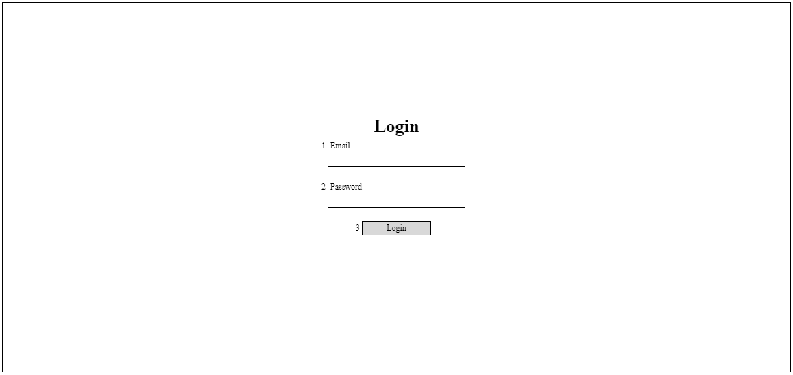

# A-LOG-01 ログイン

### 担当者

前田

### Portrait

## 項目一覧

| No. | 項目名 | 更新/表示 | 部品種類 | 必須 | 文字数 | 入力制限 | デフォルト | 「login」APIのリクエスト |
| - | - | - | - | - | - | - | - | - |
| 1 | Email | 更新 | text | Y | - | email | - | email |
| 2 | Password | 更新 | password | Y | - | - | - | password |
| 3 | Login | 表示 | button | - | - | - | - | - |

## 処理概要

### 押下イベント

| No. | 項目名 | 仕様 |
| - | - | - |
| 3 | Login | 1. JSでチェックを行い、不正のデータであれば共通処理に従いエラーを表示 　　必須チェック。エラーメッセージ：[requiredError] 　　メールのフォーマットチェック。エラーメッセージ：[formatError]、{1} =「メールアドレス」で渡す  2. 「login」APIを実行 　失敗した場合 　　APIから返却されたエラーメッセージを表示 　成功した場合 　　「A-USR-01 ユーザー一覧」画面へ遷移 |