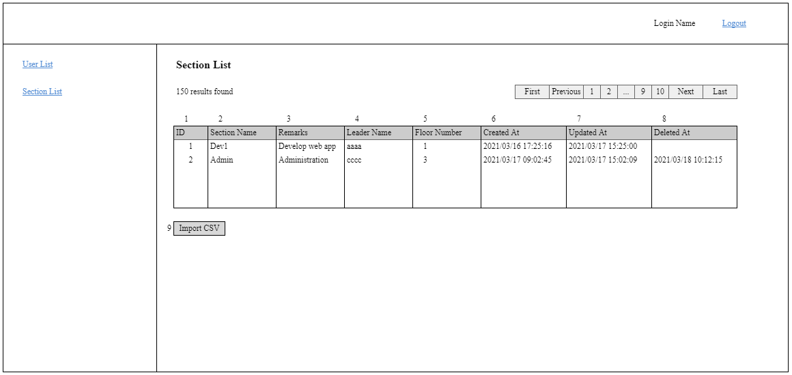

# A-SEC-01 部署一覧

### 担当者

前田

### Portrait

## 項目一覧

### 部署一覧

| No. | 項目名 | 更新/表示 | 部品種類 | 必須 | 文字数 | 入力制限 | デフォルト | 「sectionSearch」APIのレスポンス |
| - | - | - | - | - | - | - | - | - |
| 1 | ID | 表示 | label | - | - | - | - | id |
| 2 | Section Name | 表示 | label | - | - | - | - | name |
| 3 | Remarks | 表示 | label | - | - | - | - | remarks |
| 4 | Leader Name | 表示 | label | - | - | - | - | leaderName |
| 5 | Floor Number | 表示 | label | - | - | - | - | floorNum |
| 6 | Created At | 表示 | label | - | - | - | - | createdAt |
| 7 | Updated At | 表示 | label | - | - | - | - | updatedAt |
| 8 | Deleted At | 表示 | label | - | - | - | - | deletedAt |

### ボタン

| No. | 項目名 | 更新/表示 | 部品種類 | 必須 | 文字数 | 入力制限 | デフォルト |
| - | - | - | - | - | - | - | - |
| 9 | Import CSV | 表示 | button | - | - | - | - |

## 処理概要

### 初期表示

| No. | 項目名 | 仕様 |
| - | - | - |
| - | 画面起動 | 「sectionSearch」APIを実行し、sort = 1、limit = 20、offset = 0で送信 　失敗した場合 　　APIから返却されたエラーメッセージを表示 　成功した場合 　　APIから返却されたデータを部署一覧部に反映 |
| - | 部署一覧 | 検索結果が0件の場合、検索結果部のヘッダーを表示せず、[noResults]のメッセージを表示 |

### 押下イベント

| No. | 項目名 | 仕様 |
| - | - | - |
| 9 | Import CSV | 1. CSVファイルを選択させるウィンドウを表示 　CSV以外のファイルを選択した場合、[filetypeError]のエラーとする 　選択されたCSVファイルのフォーマット（ヘッダー）が「Input CSV Format」の設計と合わせない場合、[csvFormatError]のエラーとする   2. CSVファイルの内容に対してバリデーションチェックを行う 　sectionテーブルのテーブル設計書を元に必須チェックを行う。エラーメッセージ：[requiredError] 　sectionテーブルのテーブル設計書を元にフォーマット（数値）チェックを行う。エラーメッセージ：[datatypeError]、{1} =「数値」で渡す 　sectionテーブルのテーブル設計書を元にサイズチェックを行う。エラーメッセージ：[maxlengthError] 　エラーになった場合、全てのメッセージを画面に表示 　エラーメッセージの最初にエラー対象の行番号を追加する。例：「1行目：{0}は必須項目です。」  3. sectionテーブルを更新。詳細は「Import CSV Format」の設計を参照 　INSERT/UDPATE/DELETE途中にエラーが発生した場合はrollbackを行い、画面にエラーメッセージを表示 　エラーメッセージの最初にエラー対象の行番号を追加する。例：「1行目：{該当する{0}がありません。」  4. DB登録処理が失敗した場合、[importFail]の失敗メッセージを表示（ICL015） 　DB登録処理が成功した場合、当画面をリロードし、[importSuccess]の成功メッセージを表示 |

## Import CSV Format

| ヘッダー | コンテンツ |
| - | - |
| ID | section.id |
| Section Name | section.name |
| Remarks | section.remarks |
| Leader ID | section.leaderId |
| Floor Number | section.floorNum |
| Delete | "Y" |

### 処理

1レコード目はヘッダーとして取り込まない 
2行目以降のテーブルを取り込み対象とする 
「ID」 != ブランク かつ sectionテーブルに該当するidが存在しない場合、[notExistError]のエラーとする 
「ID」 != ブランク かつ sectionテーブルに該当するidが存在する場合、そのsection.idを更新し、section.updatedAt = システム日時で更新 
「ID」 != ブランク かつ sectionテーブルに該当するidが存在する かつ 「Delete」 = 「Y」の場合、該当するレコードを論理削除 
「ID」 = ブランクの場合、新規登録とし、idは自動採番を行う 
「Leader ID」に該当するuser.idが存在しない場合、[notExistError]のエラーとする