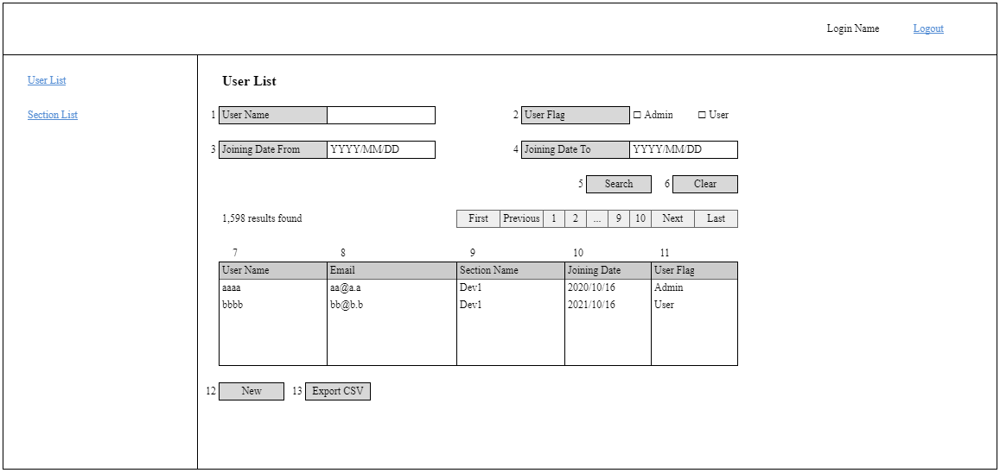

# A-USR-01 ユーザー一覧

### 担当者

前田

### Portrait

## 項目一覧

### 検索条件

| No. | 項目名 | 更新/表示 | 部品種類 | 必須 | 文字数 | 入力制限 | デフォルト | 「userSearch」APIのリクエスト |
| - | - | - | - | - | - | - | - | - |
| 1 | User Name | 更新 | text | - | 50 | - | - | name |
| 2 | User Flag | 更新 | check | - | - | 1:Admin 2:User | - | userFlag |
| 3 | Joining Date From | 更新 | date | - | - | yyyy/mm/dd | - | joiningDateFrom |
| 4 | Joining Date To | 更新 | date | - | - | yyyy/mm/dd | - | joiningDateTo |
| 5 | Search | 表示 | button | - | - | - | - | - |
| 6 | Clear | 表示 | button | - | - | - | - | - |

### 検索結果

| No. | 項目名 | 更新/表示 | 部品種類 | 必須 | 文字数 | 入力制限 | デフォルト | データ参照カラム |
| - | - | - | - | - | - | - | - | - |
| 7 | User Name | 表示 | link | - | - | - | - | name |
| 8 | Email | 表示 | label | - | - | - | - | email |
| 9 | Section Name | 表示 | label | - | - | - | - | sectionName |
| 10 | Joining Date | 表示 | label | - | - | - | - | joiningDate |
| 11 | User Flag | 表示 | label | - | - | 0:Admin 1:User | - | userFlag |

### ボタン

| No. | Tên hạng mục | 更新/表示 | 部品種類 | 必須 | 文字数 | 入力制限 | デフォルト |
| - | - | - | - | - | - | - | - |
| 12 | New | 表示 | button | - | - | - | - |
| 13 | Export CSV | 表示 | button | - | - | - | - |

## 処理概要

### 権限

| No. | 項目名 | 更新/表示 |
| - | - | - |
| 7 | User Name | 「Admin」の場合：linkとして表示 それ以外の場合：labelとして表示 |
| 12 | New | 「Admin」の場合：表示 それ以外の場合：非表示 |
| 13 | Export CSV | 「Admin」の場合：表示 それ以外の場合：非表示 |

### 初期表示

| No. | 項目名 | 仕様 |
| - | - | - |
| - | 画面起動 | 検索条件部に入力されている値で「userSearch」APIを実行し、limit = 20、offset = 0で送信 　失敗した場合 　　APIから返却されたエラーメッセージを表示 　成功した場合 　　APIから返却されたデータを結果一覧部に反映 |
| - | 検索条件 | セッションに検索条件が保存されている場合、保存されている検索条件を画面に反映し、検索を行う セッションに検索条件が保存されていない場合、デフォールト値で検索を行う |
| - | 結果一覧 | 検索結果が0件の場合、検索結果部のヘッダーを表示せず、[noResults]のメッセージを表示 |
| 3 | Joining Date From | 「YYYY/MM/DD」というプレースホルダーテキストを表示 |
| 4 | Joining Date To | 「YYYY/MM/DD」というプレースホルダーテキストを表示 |
| 13 | Export CSV | 検索結果が0件の場合、非表示 |

### 押下イベント

| No. | 項目名 | 仕様 |
| - | - | - |
| 5 | Search | 1. JSでバリデーションチェックを行い、不正データであれば共通処理に従いエラーを表示し、処理中断 	日付のフォーマットチェック。エラーメッセージ：[formatError]、{1} =「日付」で渡す 	入力された「Joining Date From」>「Joining Date To」の場合、エラーとする。エラーメッセージ：[fromToError] 2. 「userSearch」APIを再実行し、検索結果を更新 	検索条件をセッションに保存 |
| 6 | Clear | セッションに保存されている検索条件と、画面に入力されている検索条件をデフォールト値にリセット |
| 7 | User Name | 押下されたuser.idを渡して「A-USR-02 ユーザー新規更新削除」へ遷移 |
| 12 | New | 何も渡せずに「A-USR-02 ユーザー新規更新削除」画面へ遷移 |
| 13 | Export CSV | CSVファイルを出力 「Export CSV Format」の設計を参照 |

## Export CSV Format

| ヘッダー | コンテンツ |
| - | - |
| ID | user.id |
| User Name | user.name |
| Email | user.email |
| Section ID | user.sectionId |
| Section Name | section.name |
| Joining Date | user.joiningDate |
| User Flag | user.userFlag |
| CreatedAt | user.createdAt |
| UpdatedAt | user.updatedAt |

### 処理

ファイル名：user_yyyymmddhhmmss
　※yyyymmddhhmmss：出力日時（JST）
検索結果を全て出力 データの並び順は画面の表示順と同じ ヘッダーと出力データは””で囲む 
user.sectionIdに紐づく論理削除されていないsection.idが存在しない場合、「Section Name」項目に何も表示しない
