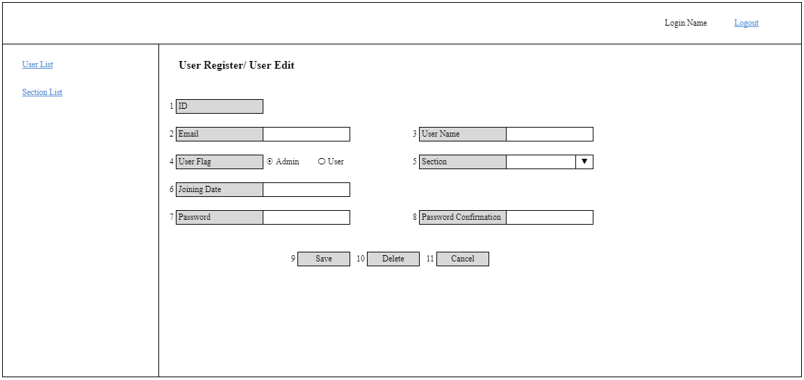

# A-USR-02 ユーザー新規更新削除

### 担当者

前田

### Portrait

## 項目一覧

### 入力フォーム

| No. | 項目名 | 更新/表示 | Type | 必須 | 文字数 | 入力制限 | デフォルト | 「sectionSearch」APIのレスポンス | 「userSearchId」APIのレスポンス | 「userCreate」/「userUpdate」APIのリクエスト |
| - | - | - | - | - | - | - | - | - | - | - |
| 1 | ID | 表示 | label | - | - | - | - | - | id | (id) |
| 2 | Email | 表示/更新 | text | Y | 255 | メールアドレス | - | - | email | email |
| 3 | User Name | 表示/更新 | text | Y | 50 | - | - | - | name | name |
| 4 | User Flag | 表示/更新 | radio | Y | - | 0:Admin 1:User | - | - | userFlag | userFlag |
| 5 | Section | 表示/更新 | list | Y | - | - | - | id name | sectionId | sectionId |
| 6 | Joining Date | 表示/更新 | date | Y | - | yyyy/mm/dd | - | - | joiningDate | joiningDate |
| 7 | Password | 更新 | text | (Y) | 20 | [0-9] [a-z] | - | - | - | (password) |
| 8 | Password Confirmation | 更新 | text | (Y) | 20 | - | - | - | - | - |

### ボタン

| No. | 項目名 | 更新/表示 | 部品種類 | Required | 文字数 | 入力制限 | デフォルト |
| - | - | - | - | - | - | - | - |
| 9 | Save | 表示 | button | - | - | - | - |
| 10 | Delete | 表示 | button | - | - | - | - |
| 11 | Cancel | 表示 | button | - | - | - | - |

## 処理概要

### Quyền hạn

| No. | 項目名 | Cho nhập/hiển thị |
| - | - | - |
| 2 | Email | 「Admin」の場合：更新 それ以外の場合：表示 |
| 3 | User Name | 「Admin」の場合：更新 それ以外の場合：表示 |
| 4 | User Flag | 「Admin」の場合：更新 それ以外の場合：表示 |
| 5 | Section | 「Admin」の場合：更新 それ以外の場合：表示 |
| 6 | Joining Date | 「Admin」の場合：更新 それ以外の場合：表示 |
| 10 | Delete | 「Admin」の場合：表示 それ以外の場合：非表示 |

### 初期表示

| No. | 項目名 | Spec |
| - | - | - |
| - | 画面起動 | 1. GET Parameter:user_idがない場合、「userSearchId」APIを実行しない GET Parameter:user_idがある場合、「userSearchId」APIを実行し、id = GET Parameter:user_idで送信 　失敗した場合 　　APIから返却されたエラーメッセージを表示 　成功した場合 　　APIから返却されたデータを入力フォームに反映  2. 「sectionSearch」APIを実行し、sort = 2、deleted = 0で送信 　失敗した場合 　　APIから返却されたエラーメッセージを表示 　成功した場合 　　APIから返却されたデータを「Section」項目のリスト値とする 　　section.idをkey値、section.nameをvalue値とする |
| - | 画面タイトル | GET Parameter:user_idがない場合、「User Register」と表示 GET Parameter:user_idがある場合、「User Edit」と表示 |
| 1 | ID | GET Parameter:user_idがある場合のみ表示 |
| 6 | Joining Date | 「YYYY/MM/DD」というプレースホルダーテキストを表示 |
| 10 | Delete | GET Parameter:user_idがある場合のみ表示 |

### 押下イベント

| No. | 項目名 | 仕様 |
| - | - | - |
| 14 | Save | 1. JSでバリデーションチェックを行い、不正データであれば共通処理に従いエラーを表示し、処理中断 　必須チェック。エラーメッセージ：[requiredError] 　　※GET Parameter:user_idがない場合、常に「Password」「Password Confirmation」に対して必須チェックを行う 　　　GET Parameter:user_idがある場合、「Password」に入力がある場合のみ「Password Confirmation」に対して必須チェックを行う 　メールのフォーマットチェック。エラーメッセージ：[formatError]、{1} = 「メールアドレス」で渡す 　日付のフォーマットチェック。エラーメッセージ：[formatError]、{1} = 「日付」で渡す 　最大文字数チェック。エラーメッセージ：[maxlengthError] 　パスワードの文字種・桁数チェック。エラーメッセージ：[passwordError] 　「Password」「Password Confirmation」が一致しない場合、エラーとする。エラーメッセージ：[confirmPasswordError]  2. エラーがない場合、下記のようにAPIを実行 　GET Parameter:user_idがない場合、「userCreate」APIをコール 　GET Parameter:user_idがある場合、「userUpdate」APIをコール 　　失敗した場合 　　　APIから返却されたエラーメッセージを表示 　　成功した場合 　　　「A-USR-01 ユーザー一覧」画面へ遷移し、[createSuccess] or [updateSuccess]のメッセージを表示（{0} =「ユーザー」で渡す） |
| 15 | Delete | ログインユーザーのuser.id = GET Parameter:user_idの場合、[deleteLoginAccountError]のエラーとする それ以外の場合、[deleteConfirm]の確認ダイアログを表示（{0} =「ユーザー」で渡す） 　「Cancel」を押下すれば、ダイアログを閉じる 　「OK」を押下すれば、「userDelete」APIをコール 　　失敗した場合 　　　APIから返却されたエラーメッセージを表示 　　成功した場合 　　　「A-USR-01 ユーザー一覧」画面へ遷移し、[deleteSuccess]のメッセージを表示（{0} =「ユーザー」で渡す）	|
| 16 | Cancel | 「A-USR-01 ユーザー一覧」に戻る |
