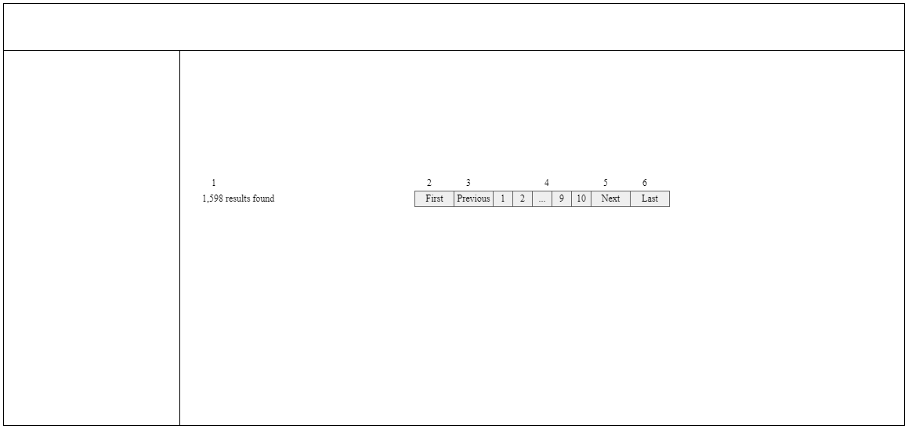

# 共通処理

### 担当者

Vy.DT

# ヘッダー・メニュー

### Portrait

## 項目一覧

### ヘッダー

| No. | 項目名 | 更新/表示 | 部品種類 | 必須 | 文字数 | 入力制限 | デフォルト |
| - | - | - | - | - | - | - | - |
| 1 | Login Name | 表示 | link | - | - | - | - |
| 2 | Logout | 表示 | link | - | - | - | - |

### 左メニュー

| No. | 項目名 | 更新/表示 | 部品種類 | 必須 | 文字数 | 入力制限 | デフォルト |
| - | - | - | - | - | - | - | - |
| 3 | User List | 表示 | link | - | - | - | - |
| 4 | Section List | 表示 | link | - | - | - | - |

## 処理概要

### 権限

| No. | 項目名 | 更新/表示 |
| - | - | - |
| 4 | Section List | 「Admin」の場合：表示 それ以外の場合：非表示 |

### 初期表示

| No. | 項目名 | 仕様 |
| - | - | - |
| 1 | Login Name | セッションに保存されているログインユーザーのuser.nameを取得し表示 |

### 押下イベント

| No. | 項目名 | 仕様 |
| - | - | - |
| 1 | Login Name | ログインユーザーのuser.idを渡して、「A-USR-02 ユーザー新規更新削除」画面へ遷移 |
| 2 | Logout | 「ログアウト」APIをコール 　失敗した場合 　　APIから返却されたエラーメッセージを表示 　成功した場合 　　「A-LOG-01 ログイン」画面へ遷移 |
| 3 | User List | 「A-USR-01 ユーザー一覧」画面へ遷移 |
| 4 | Section List | 「A-SEC-01 部署一覧」画面へ遷移 |

# ページング

### Portrait

## 項目一覧

| No. | 項目名 | 更新/表示 | 部品種類 | 必須 | 文字数 | 入力制限 | デフォルト |
| - | - | - | - | - | - | - | - |
| 1 | 検索結果件数 | 表示 | label | - | - | - | - |
| 2 | First Page | 表示 | link | - | - | - | - |
| 3 | Previous | 表示 | link | - | - | - | - |
| 4 | ページ番号 | 表示 | link | - | - | - | - |
| 5 | Next | 表示 | link | - | - | - | - |
| 6 | Last Page                | 表示 | link | - | - | - | - |

## 処理概要

### 初期表示

| No. | 項目名 | 仕様 |
| - | - | - |
| - | ページング | 検索結果 != 0件の場合のみ表示 |
| 2,3 | First Page Previous | 現在のページが最初のページではない場合のみ活性 |
| 4 | Số trang | 現在ページではないページ番号のみ活性 |
| 5,6 | Next Last Page | 現在のページが最終のページではない場合のみ活性 |

### 押下イベント

| No. | 項目名 | 仕様 |
| - | - | - |
| 2 | First Page | 最初の検索結果ページを表示 |
| 3 | Previous | 現在のページの1つ前のページを表示 |
| 4 | Số trang | 押下された番号のページを表示 |
| 5 | Next | 現在のページの1つ後のページを表示 |
| 6 | Last Page | 最終の検索結果ページを表示 |

# 画面クライアント側のバリデーションチェック

##### ■チェック内容と表示メッセージ：

詳細は「メッセージ一覧」と各画面の設計書を参照

##### ■チェック優先順位：

(i) 必須チェック 
(ii) 形チェック 
(iii) 文字数チェック 
(iv) その他チェック

##### ■チェックタイミング：

- フォーカスアウトした時 
- サブミットボタン押下時

##### ■実装：

Validate JS 使用

# エラー時の処理概要

処理を中断し、エラーメッセージを表示 

##### ■クライアント側のチェックでエラーが発生した場合：

- エラーになった項目のラベルの色と枠の色または選択肢の色を赤にする 
- 赤字でエラーになった項目の入力欄の直下にエラーメッセージを表示

##### ■APIからエラーが返却された場合：

- APIから400エラーが返却された場合：現在の画面に留まり、画面で入力された値をそのままに表示し、誘導記事の直下、またはページのタイトルの直下、または画面の一番上に赤字でエラーメッセージを表示 
- APIから403、404、500エラーが返却された場合：下記の通りに共通エラー画面を表示

##### ■例外エラーが発生した場合：

以下メッセージを表示した共通エラー画面へ遷移

- アクセス権限がない場合（403エラー） 「アクセスしようとした画面の権限がありません。」とのメッセージを表示
- 該当画面が存在しない場合（404エラー） 
「アクセスしようとした画面が見つかりません。」とのメッセージを表示
- 重大なエラーが発生した場合（500エラー）
「システムエラーが発生しました、システム管理者へお問い合わせください。」とのメッセージを表示

# ログインの処理概要

##### ■ログインしていない状態で：													
ログイン画面にアクセス → ログイン → TOP画面へ遷移 
ログイン必要の画面にアクセス → ログイン画面表示 → ログイン → アクセスしようとした画面へ遷移 
ログイン不要の画面にアクセス → アクセスしようとした画面表示（ログイン画面表示しない）

##### ■ログインしている状態で：

ログイン画面にアクセス → ログイン → TOP画面へ遷移 
他の画面にアクセス → アクセスしようとした画面表示

# セッションタイムアウト時の処理概要

##### ■セッションの有効期限：

30分

##### ■セッションの有効期限が切れた状態で：

直リンク（画面リフレッシュ、ブラウザバックを含む）で管理系のいずれかの画面にアクセス → 未ログイン状態のように扱う 
画面内の遷移ボタン・遷移リンク押下 → セッション切れのアラート表示 → ログイン画面へ遷移 → ログイン → 遷移先画面へ遷移 
画面内の検査ボタン・保存ボタン・ダウンロードボタン押下 → セッション切れのアラート表示 → ログイン画面へ遷移 → ログイン → セッション切れた時の画面へ遷移