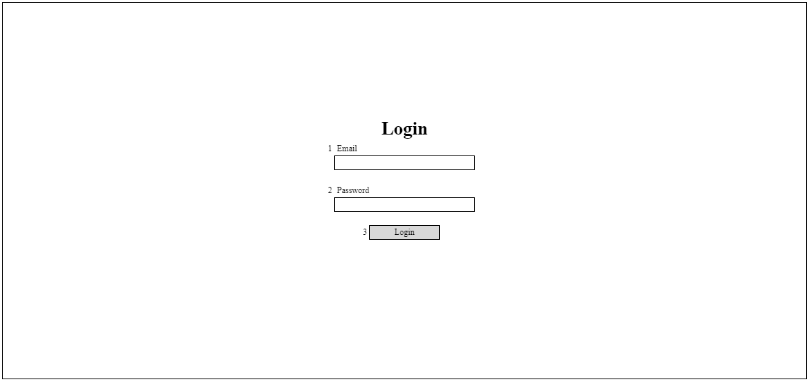

# A-LOG-01 ログイン

### Người phụ trách

Maeda

### Portrait

## Danh sách hạng mục

| No. | Tên hạng mục | Cho nhập/ Hiển thị | Chủng loại | Required | Max-length | Giới hạn nhập | Default | Request API [login] |
| - | - | - | - | - | - | - | - | - |
| 1 | Email | Cho nhập | text | Y | - | email | - | email |
| 2 | Password | Cho nhập | password | Y | - | - | - | password |
| 3 | Login | Hiển thị | button | - | - | - | - | - |

## Khái quát xử lý

### Event nhấn nút/ nhấn link

| No. | Tên hạng mục | Spec |
| - | - | - |
| 3 | Login | 1. Thực hiện check bằng JS, nếu có dữ liệu không hợp lệ thì hiển thị lỗi theo xử lý chung 　　Check required. Error message [requiredError] 　　Check format Email. Error message [formatError], truyền {1} = メールアドレス  2. Call API [login] 　Trường hợp thất bại 　　Hiển thị lỗi API trả về 　Trường hợp thành công 　　Chuyển đến màn hình [A-USR-01 ユーザー一覧] |