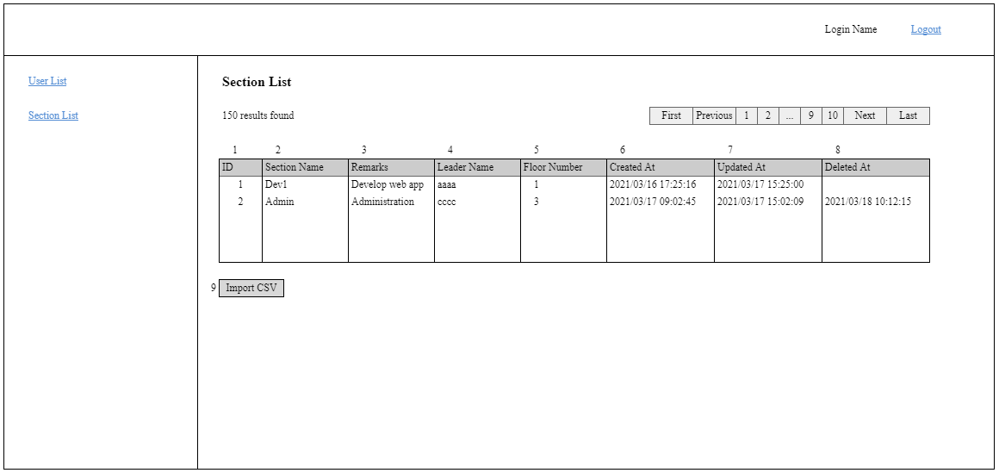

# A-SEC-01 部署一覧

### Người phụ trách

Maeda

### Portrait

## Danh sách hạng mục

### Phần Section List

| No. | Tên hạng mục | Cho nhập/ Hiển thị | Chủng loại | Required | Max-length | Giới hạn nhập | Default | Response API [sectionSearch] |
| - | - | - | - | - | - | - | - | - |
| 1 | ID | Hiển thị | label | - | - | - | - | id |
| 2 | Section Name | Hiển thị | label | - | - | - | - | name |
| 3 | Remarks | Hiển thị | label | - | - | - | - | remarks |
| 4 | Leader Name | Hiển thị | label | - | - | - | - | leaderName |
| 5 | Floor Number | Hiển thị | label | - | - | - | - | floorNum |
| 6 | Created At | Hiển thị | label | - | - | - | - | createdAt |
| 7 | Updated At | Hiển thị | label | - | - | - | - | updatedAt |
| 8 | Deleted At | Hiển thị | label | - | - | - | - | deletedAt |

### Phần button

| No. | Tên hạng mục | Cho nhập/ Hiển thị | Chủng loại | Required | Max-length | Giới hạn nhập | Default |
| - | - | - | - | - | - | - | - |
| 9 | Import CSV | Hiển thị | button | - | - | - | - |

## Khái quát xử lý

### Hiển thị ban đầu

| No. | Tên hạng mục | Spec |
| - | - | - |
| - | Khởi động màn hình | Call API [sectionSearch], gửi sort = 1, limit = 20, offset = 0 　Trường hợp thất bại 　　Hiển thị lỗi API trả về 　Trường hợp thành công 　　Phản ánh data API trả về vào phần SectionList |
| - | Phần Section List | Trường hợp 0 record thì hiển thị message [noResults], không hiển thị header của bảng |

### Event nhấn nút/ nhấn link

| No. | Tên hạng mục | Spec |
| - | - | - |
| 9 | Import CSV | 1. Hiển thị cửa sổ cho chọn file CSV 　Trường hợp chọn file khác CSV, hiển thị message lỗi [filetypeError] 　Trường hợp file CSV đã chọn có format (header) khác với sheet [Input CSV Format], hiển thị message lỗi [csvFormatError]  2. Check validation nội dung file CSV 　Check required dựa trên thiết kế bảng của bảng section. Error message [requiredError] 　Check format số dựa trên thiết kế bảng của bảng section. Error message [datatypeError], truyền {1} = 数値 　Check size dựa trên thiết kế bảng của bảng section. Error message [maxlengthError] 　Trường hợp bị lỗi thì hiển thị ra màn hình tất cả message lỗi 　Thêm số thứ tự dòng bị lỗi vào phía trước của error message. Ví dụ: "1行目：{0}は必須項目です。"  3. Cập nhật bảng section, chi tiết tham khảo sheet "Import CSV Format" 　Trường hợp phát sinh lỗi khi đang insert/update/delete thì thực hiện rollback, hiển thị ra màn hình message lỗi. 　Thêm số thứ tự dòng bị lỗi vào phía trước của error message. Ví dụ: "1行目：該当する{0}がありません。"  4. Nếu xử lý thất bại thì hiển thị message báo thất bại [importFail] 　Nếu xử lý thành công thì reload lại trang này, hiển thị message báo thành công [importSuccess] |

## Phần Import CSV Format

| Header | Content |
| - | - |
| ID | section.id |
| Section Name | section.name |
| Remarks | section.remarks |
| Leader ID | section.leaderId |
| Floor Number | section.floorNum |
| Delete | "Y" |

### Xử lý

Dòng đầu tiền là dòng header nên không lưu dữ liệu 
Bắt đầu lấy dữ liệu từ dòng 2 của bảng 
Trường hợp cột [ID] != trống và không có dữ liệu tương ứng thì hiển thị message lỗi [notExistError] 
Trường hợp cột [ID] != trống và có dữ liệu tương ứng thì cập nhật section.id tương ứng, lưu section.updatedAt = system datetime 
Trường hợp cột [ID] != trống và có dữ liệu tương ứng và ở cột [Delete] là "Y" thì thực hiện xóa logic record tương ứng 
Trường hợp cột [ID] = trống thì thực hiện đăng kí mới, tự động đánh số id 
Trường hợp không có dữ liệu tương ứng với cột [Leader ID] thì hiển thị message lỗi [notExistError]