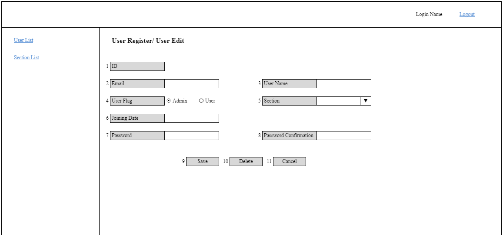

# A-USR-02 ユーザー新規更新削除

### Người phụ trách

Maeda

### Portrait

## Danh sách hạng mục

### Phần form nhập

| No. | Tên hạng mục | Cho nhập/ Hiển thị | Chủng loại | Required | Max-length | Giới hạn nhập | Default | Response API [sectionSearch] | Response API [userSearchId] | Request API [userCreate]/ [userUpdate] |
| - | - | - | - | - | - | - | - | - | - | - |
| 1 | ID | Hiển thị | label | - | - | - | - | - | id | (id) |
| 2 | Email | Hiển thị/ Cho nhập | text | Y | 255 | email | - | - | email | email |
| 3 | User Name | Hiển thị/ Cho nhập | text | Y | 50 | - | - | - | name | name |
| 4 | User Flag | Hiển thị/ Cho chọn | radio | Y | - | 0:Admin 1:User | - | - | userFlag | userFlag |
| 5 | Section | Hiển thị/ Cho chọn | list | Y | - | - | - | id name | sectionId | sectionId |
| 6 | Joining Date | Hiển thị/ Cho nhập | date | Y | - | yyyy/mm/dd | - | - | joiningDate | joiningDate |
| 7 | Password | Cho nhập | text | (Y) | 20 | [0-9] [a-z] | - | - | - | (password) |
| 8 | Password Confirmation | Cho nhập | text | (Y) | 20 | - | - | - | - | - |

### Phần button

| No. | Tên hạng mục | Cho nhập/ Hiển thị | Chủng loại | Required | Max-length | Giới hạn nhập | Default |
| - | - | - | - | - | - | - | - |
| 9 | Save | Hiển thị | button | - | - | - | - |
| 10 | Delete | Hiển thị | button | - | - | - | - |
| 11 | Cancel | Hiển thị | button | - | - | - | - |

## Khái quát xử lý

### Quyền hạn

| No. | Tên hạng mục | Cho nhập/ Hiển thị |
| - | - | - |
| 2 | Email | Quyền hạn [Admin]: Cho nhập Quyền hạn khác: Hiển thị |
| 3 | User Name | Quyền hạn [Admin]: Cho nhập Quyền hạn khác: Hiển thị |
| 4 | User Flag | Quyền hạn [Admin]: Cho chọn Quyền hạn khác: Hiển thị |
| 5 | Section | Quyền hạn [Admin]: Cho chọn Quyền hạn khác: Hiển thị |
| 6 | Joining Date | Quyền hạn [Admin]: Cho nhập Quyền hạn khác: Hiển thị |
| 10 | Delete | Quyền hạn [Admin]: Hiển thị Quyền hạn khác: Không hiển thị |

### Hiển thị ban đầu

| No. | Tên hạng mục | Spec |
| - | - | - |
| - | Khởi động màn hình | 1. Trường hợp không có GET Parameter:user_id, không call API [userSearchId] Trường hợp có GET Parameter:user_id, call API [userSearchId], gửi id = GET Parameter:user_id 　Trường hợp thất bại 　　Hiển thị lỗi API trả về 　Trường hợp thành công 　　Phản ánh data API trả về vào phần form nhập  2. Call API [sectionSearch], gửi sort = 2, deleted = 0 　Trường hợp thất bại 　　Hiển thị lỗi API trả về 　Trường hợp thành công 　　Phản ánh data API trả về vào làm list giá trị hạng mục [Section] 　　Lấy section.id làm giá trị key, section.name làm giá trị value |
| - | Title màn hình | Trường hợp không có GET Parameter:user_id, hiển thị tên màn hình là [User Register] Trường hợp có GET Parameter:user_id, hiển thị tên màn hình là [User Edit] |
| 1 | ID | Chỉ hiển thị khi có GET Parameter:user_id |
| 6 | Joining Date | Hiển thị place holder text [YYYY/MM/DD] |
| 10 | Delete | Chỉ hiển thị khi có GET Parameter:user_id |

### Event nhấn nút/ nhấn link

| No. | Tên hạng mục | Spec |
| - | - | - |
| 9 | Save | 1. Thực hiện check validation bằng JS, nếu có dữ liệu không hợp lệ thì hiển thị lỗi theo xử lý chung 　Check required. Error message [requiredError] 　　※Trường hợp không có GET Parameter, luôn check required "Password" và "Password Confirmation" 　　　Trường hợp có GET Parameter, chỉ check required "Password Confirmation" khi "Password" có nhập 　Check format email. Error message [formatError], truyền {1} = メールアドレス 　Check format date. Error message [formatError], truyền {1} = 日付 　Check max-length. Error message [maxlengthError] 　Check format chữ số 1 byte và length "Password". Error message [passwordError] 　Nếu "Password", "Password Confirmation" không khớp. Error message [confirmPasswordError]  2. Nếu không có lỗi, thực hiện call API như sau 　Trường hợp không có GET Parameter:user_id, call API [userCreate] 　Trường hợp có GET Parameter:user_id, call API [userUpdate] 　　Trường hợp thất bại 　　　Hiển thị lỗi API trả về 　　Trường hợp thành công 　　　Chuyển đến màn hình [A-USR-01 ユーザー一覧], hiển thị message [createSuccess] or [updateSuccess], truyền {0} = ユーザー	|
| 10 | Delete | Trường hợp user.id của login user = GET Parameter:user_id thì hiển thị lỗi [deleteLoginAccountError] Trường hợp khác thì hiển thị dialog xác nhận [deleteConfirm], truyền {0} = ユーザー 　Nhấn [Cancel] thì đóng dialog lại 　Nhấn [OK] thì call API [userDelete] 　　Trường hợp thất bại 　　　Hiển thị lỗi API trả về 　　Trường hợp thành công 　　　Chuyển đến màn hình [A-USR-01 ユーザー一覧], hiển thị message [deleteSuccess], truyền {0} = ユーザー |
| 11 | Cancel | Quay lại màn hình [A-USR-01 ユーザー一覧] |