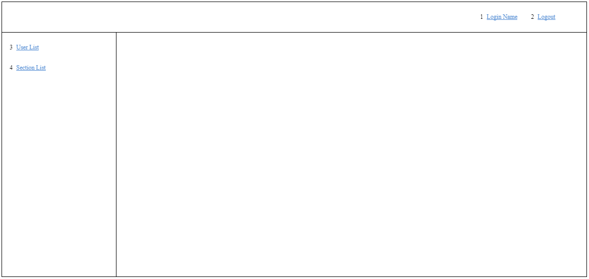
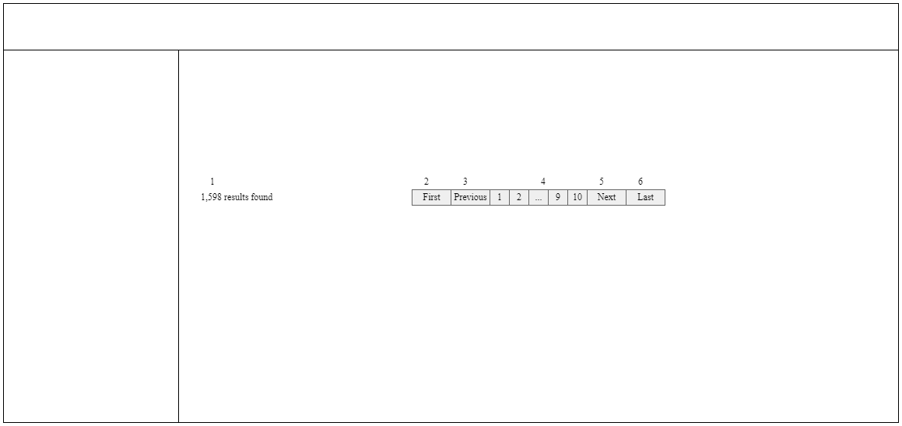

# Xử lý chung

### Người phụ trách

Vy.DT

# Header-Menu

### Portrait

## Danh sách hạng mục

### Header

| No. | Tên hạng mục | Cho nhập/ Hiển thị | Chủng loại | Required | Max-length | Giới hạn nhập | Default |
| - | - | - | - | - | - | - | - |
| 1 | Login Name | Hiển thị | link | - | - | - | - |
| 2 | Logout | Hiển thị | link | - | - | - | - |

### Left-menu

| No. | Tên hạng mục | Cho nhập/ Hiển thị | Chủng loại | Required | Max-length | Giới hạn nhập | Default |
| - | - | - | - | - | - | - | - |
| 3 | User List | Hiển thị | link | - | - | - | - |
| 4 | Section List | Hiển thị | link | - | - | - | - |

## Khái quát xử lý

### Quyền hạn

| No. | Tên hạng mục | Cho nhập/ Hiển thị |
| - | - | - |
| 4 | Section List | Quyền hạn [Admin]: Hiển thị Quyền hạn khác: Không hiển thị |

### Hiển thị ban đầu

| No. | Tên hạng mục | Spec |
| - | - | - |
| 1 | Login Name | hiển thị user.name của login user lưu trong session |

### Event nhấn nút/ nhấn link

| No. | Tên hạng mục | Spec |
| - | - | - |
| 1 | Login Name | Chuyển đến màn hình [A-USR-02 ユーザー新規更新削除], truyền user.id của login user |
| 2 | Logout | Call API logout 　Trường hợp thất bại 　　Hiển thị lỗi API trả về 　Trường hợp thành công 　　Chuyển đến màn hình [A-LOG-01 ログイン] |
| 3 | User List | Chuyển đến màn hình [A-USR-01 ユーザー一覧] |
| 4 | Section List | Chuyển đến màn hình [A-SEC-01 部署一覧] |

# Paging

### Portrait

## Danh sách hạng mục

| No. | Tên hạng mục | Cho nhập/ Hiển thị | Chủng loại | Required | Max-length | Giới hạn nhập | Default |
| - | - | - | - | - | - | - | - |
| 1 | Số record kết quả search | Hiển thị | label | - | - | - | - |
| 2 | First Page | Hiển thị | link | - | - | - | - |
| 3 | Previous | Hiển thị | link | - | - | - | - |
| 4 | Số trang | Hiển thị | link | - | - | - | - |
| 5 | Next | Hiển thị | link | - | - | - | - |
| 6 | Last Page                | Hiển thị | link | - | - | - | - |

## Khái quát xử lý

### Hiển thị ban đầu

| No. | Tên hạng mục | Spec |
| - | - | - |
| - | Paging | Chỉ hiển thị khi kết quả search != 0 record |
| 2,3 | First Page Previous | Chỉ enable khi trang hiện tại != trang đầu tiên |
| 4 | Số trang | Chỉ enable những số trang != trang hiện tại |
| 5,6 | Next Last Page | Chỉ enable khi trang hiện tại != trang cuối cùng |

### Event nhấn nút/ nhấn link

| No. | Tên hạng mục | Spec |
| - | - | - |
| 2 | First Page | Chuyển đến trang đầu tiên |
| 3 | Previous | Chuyển đến trang ngay trước |
| 4 | Số trang | Chuyển đến trang bị nhấn nút |
| 5 | Next | Chuyển đến trang kế tiếp |
| 6 | Last Page | Chuyển đến trang cuối cùng |

# Check validation phía client màn hình

##### ■Nội dung check và message hiển thị:

Chi tiết xem file [Danh sách message] và thiết kế các màn hình

##### ■Thứ tự ưu tiên check:

(i) Check required 
(ii) Check format 
(iii) Check length 
(iv) Check khác

##### ■Thời điểm check:

- Khi focus-out 
- Khi nhấn nút submit

##### ■Code:

Sử dụng Validate JS

# Khái quát xử lý lúc lỗi

Dừng xử lý, hiển thị message lỗi 

##### ■Khi xảy ra lỗi check validate phía client:

- Đổi label và viền ô nhập hoặc option của hạng mục bị lỗi thành màu đỏ 
- Hiển thị message lỗi màu đỏ ngay bên dưới ô nhập của hạng mục bị lỗi

##### ■Khi xảy ra lỗi do API trả về:

- Trường hợp API trả về lỗi 400: Dừng ở màn hình hiện tại, giữ nguyên các giá trị nhập trên màn hình, hiển thị message lỗi bằng màu đỏ ngay bên dưới phần hướng dẫn, hoặc ngay bên dưới title trang, hoặc ở trên cùng của màn hình (tùy theo cấu trúc trang) 
- Trường hợp API trả về lỗi 403, 404, 500: Hiển thị màn hình lỗi chung như bên dưới

##### ■Khi phát sinh lỗi ngoại lệ:

Chuyển sang màn hình lỗi chung mà hiển thị các message dưới đây

- Khi không có quyền truy cập (Lỗi 403) 
Hiển thị message [アクセスしようとした画面の権限がありません。]

- Khi không tồn tại màn hình (Lỗi 404) 
Hiển thị message [アクセスしようとした画面が見つかりません。]

- Khi phát sinh lỗi quan trọng (Lỗi 500) 
Hiển thị message [システムエラーが発生しました、システム管理者へお問い合わせください。]

# Khái quát xử lý login

##### ■Ở trạng thái chưa login:

Truy cập màn hình login　→　Login　→　Chuyển đến màn hình TOP 
Truy cập màn hình cần phải login　→　Hiển thị màn hình login　→　Login　→　Chuyển đến màn hình muốn truy cập 
Truy cập màn hình không cần login　→　Hiển thị màn hình muốn truy cập (không hiển thị màn hình login)

##### ■Ở trạng thái đang login:

Truy cập màn hình login　→　Login　→　Chuyển đến màn hình TOP 
Truy cập màn hình khác　→　Hiển thị màn hình muốn truy cập

# Khái quát xử lý khi session timeout

##### ■Hiệu lực của session:

30 phút

##### ■Ở trạng thái session timeout:

Truy cập vào bất kỳ màn hình nào cụm admin bằng link trực tiếp (bao gồm cả refresh màn hình, nhấn nút browser back)　→　Xử lý như trạng thái chưa login 
Nhấn nút hoặc link chuyển màn hình nằm trong màn hình　→　Hiển thị alert thông báo session timeout　→　Cho chuyển tới màn hình login　→　Login lại　→　Cho chuyển tới màn hình là đích chuyển hướng 
Nhấn nút có chức năng search / lưu / download nằm trong màn hình　→　Hiển thị alert thông báo session timeout　→　Cho chuyển tới màn hình login　→　Login lại　→　Cho chuyển tới màn hình khi timeout